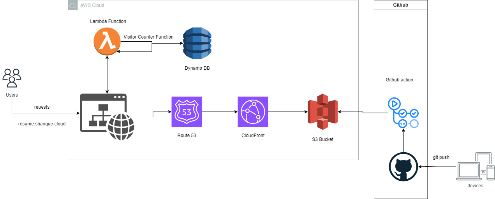

# AWS Cloud Resume Challenge

## Cloud Resume Challenge utilizing CloudFront, S3, Lambda, DynamoDB, with GitHub Actions CI/CD

This sample project which follows the tasks of [Cloud Resume Challenge](https://cloudresumechallenge.dev/) and was built along Youtube series by [Rishab](https://github.com/rishabkumar7/aws-cloud-resume-challenge/tree/main). This example showcases essential cloud skills for career development. 

## Infrastructure Diagram

  

## Find a bug
If you encounter an issue or have suggestions for improving this project, please submit an issue via the "Issues" tab above.

## Author

[Sharique Ali](https://github.com/sharique-tech1987)

Linkedin: [sharique](www.linkedin.com/in/sharique-khan-99934028)

